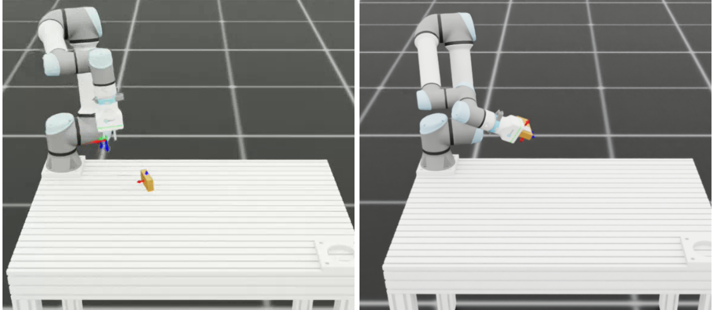

# UR5e Sim-to-Real Reach — IDEALLab Woodworking Setup

## Overview

This repository contains the full **simulation** and **sim-to-real** pipeline for the IDEALLab Woodworking setup at ETHZ: two UR5e robots (one with an OnRobot 2FG7 gripper, one with a screwdriver) trained with reinforcement learning in Isaac Lab and deployed on the real hardware via a custom impedance controller. The repository is the supporting code for my master thesis, **Reinforcement Learning for Robotic Assembly Tasks: Mitigating Simulation Error for Physical Deployment**


The project is split into two independent workflows, each running in its own conda environment:

| Workflow | Conda env | Purpose |
|---|---|---|
| **Simulation** | `env_isaaclab` | RL training, sim playback, sim benchmarking (Isaac Sim + Isaac Lab) |
| **Sim-to-Real** | `sim2real` | Real-robot deployment, impedance tuning, analysis scripts |

## What This Repository Achieves

1. Train reach policies in simulation with sim-to-real transfer in mind.
2. Export and deploy policies on the real UR5e robotic setup through ROS 2 + RTDE.
3. Study and improve transfer robustness through domain randomization experiments.
4. Characterize and tune actuator behavior with dedicated impedance tuning tools.
5. Provide and compare additional trained policies for related single- and dual-robot tasks.

## Visual Overview

### Performance Improvement with Domain Randomization


No DR (left) vs Randomization on acutator and delay 1-2 (right) 
### Dual Reach policy in Simulation


### Reach Policy in Simulation



---

## Prerequisites

| Software | Version (tested) | Notes |
|---|---|---|
| [Miniconda](https://docs.anaconda.com/miniconda/) | latest | Used to manage both environments |
| [Isaac Sim](https://developer.nvidia.com/isaac-sim) | 5.1.0 | GPU-accelerated robotics simulator |
| [Isaac Lab](https://isaac-sim.github.io/IsaacLab/) | 2.2.3 | RL framework on top of Isaac Sim |
| [ROS 2 Jazzy](https://docs.ros.org/en/jazzy/Installation.html) | Jazzy | Required only for real-robot scripts |
| [Woodworking_Robots driver](https://github.com/IDEALLab/Woodworking_Robots) | latest | Custom ROS 2 driver for the UR5e + OnRobot setup |
| Ubuntu 24.04 | latest LTS | Necessary for ROS 2. Isaac Sim also supports Windows, but this pipeline is only tested on Linux. |

---

## Installation

### 1. Simulation environment (`env_isaaclab`)

Follow the official [Isaac Lab conda installation guide](https://isaac-sim.github.io/IsaacLab/main/source/setup/installation/index.html) to create the `env_isaaclab` conda environment. It is recommended to use the pre-built Binaries installation for vs code integration.

Then install this project in editable mode:

```bash
conda activate env_isaaclab
cd <path-to-this-repo>
python -m pip install -e source/Woodworking_Simulation
```

Verify the installation:

```bash
# List all registered environments
python scripts/list_envs.py

# Quick smoke-test with a zero-action agent
python scripts/zero_agent.py --task=WWSim-Pose-Orientation-Sim2Real-Direct-v1
```

### 2. Sim-to-Real environment (`sim2real`)

Create the environment from the provided file:

```bash
conda env create -f environment_sim2real.yml
```

This installs Python 3.12, PyTorch, matplotlib, numpy, PyYAML, and the [UR RTDE Python Client](https://github.com/UniversalRobots/RTDE_Python_Client_Library) (installed from git since no PyPI release exists).

### 3. ROS 2 and the robot driver (real-robot scripts only)

1. Install [ROS 2 Jazzy](https://docs.ros.org/en/jazzy/Installation.html) following the official guide.
2. Clone and build the [Woodworking_Robots](https://github.com/IDEALLab/Woodworking_Robots) driver workspace, follow the instructions in the repo for details.
3. Source the workspace before running any `sim2real` or `tuning` script:

   ```bash
   source /opt/ros/jazzy/setup.bash
   source ~/wwro_ws/install/local_setup.bash
   ```

### 4. Import the USD assets

Download the `USD_files` folder from the [polybox link](https://polybox.ethz.ch/index.php/s/tdgY7imXcJH9qJn) and place it at the root of this repository.

### 5. IDE setup (optional)

To setup VS code, follow [VSCode setup](https://isaac-sim.github.io/IsaacLab/main/source/overview/developer-guide/vs_code.html) for IsaacLab Doc.
A recommended extension to work with URscript files is [URScript](https://marketplace.visualstudio.com/items?itemName=ahern) by Ahern Guo.

## Repository Structure

```
scripts/
  rsl_rl/          Training, playback, sim benchmark   (env_isaaclab)
  sim2real/         Real-robot deployment nodes          (sim2real + ROS 2)
  tuning/           Impedance controller gain tuning     (sim2real + ROS 2)
  utils/            Analysis & plotting utilities        (sim2real)
  benchmark_settings/  Goal files & checkpoint lists
source/
  Woodworking_Simulation/   Isaac Lab extension (environments, agents)
policies/            Pre-trained policy checkpoints
euler/               ETH Euler cluster training scripts
results/             Benchmark results (sim & real)
```

See [scripts/README.md](scripts/README.md) for a detailed folder map and quick-reference commands.

---

## Simulation Workflow (env_isaaclab)

All simulation commands require `conda activate env_isaaclab`.

### Available Environments

| Task ID | Description |
|---|---|
| `WWSim-Pose-Orientation-Sim2Real-Direct-v1` | Single UR5e, 6-dim position actions |
| `WWSim-Pose-Orientation-Sim2Real-Direct-v2` | Single UR5e, 12-dim pos + vel actions |
| `WWSim-Pose-Orientation-Two-Robots-v0` | Dual UR5e coordinated manipulation |
| `WWSim-Grasping-Single-Robot-Direct-v0` | Single robot grasping (dummy agents only) |
| `WWSim-Grasping-Dual-Robot-Direct-v0` | Dual robot grasping (dummy agents only) |

```bash
python scripts/list_envs.py   # full list with details
```

### Training

```bash
python scripts/rsl_rl/train.py --task WWSim-Pose-Orientation-Sim2Real-Direct-v1 --headless --num_envs 2048
```

Checkpoints are saved under `logs/rsl_rl/<experiment>/<run>/`.

### Playback & Export

```bash
python scripts/rsl_rl/play.py \
  --task WWSim-Pose-Orientation-Sim2Real-Direct-v1 \
  --checkpoint logs/rsl_rl/<experiment>/<run>/model_1499.pt
```

This exports `exported/policy.pt` and `exported/policy.onnx` next to the checkpoint — the TorchScript file is used for real-robot deployment.

### Simulation Benchmark

```bash
python scripts/rsl_rl/benchmark.py \
  --task WWSim-Pose-Orientation-Sim2Real-Direct-v1 \
  --checkpoint logs/rsl_rl/<experiment>/<run>/model_1499.pt \
  --goals-file scripts/benchmark_settings/goals_handmade.json
```

### Dummy Agents (environment smoke-tests)

```bash
python scripts/zero_agent.py --task=<TASK_NAME>
python scripts/random_agent.py --task=<TASK_NAME>
```

---

## Sim-to-Real Workflow (sim2real + ROS 2)

All real-robot commands require `conda activate sim2real` and a sourced ROS 2 / driver workspace.

The full deployment procedure, driver bring-up, and troubleshooting are documented in:

- [scripts/sim2real/README.md](scripts/sim2real/README.md) — deployment nodes, URScript controllers, gripper control
- [procedure_ur5e_ros2_control.md](procedure_ur5e_ros2_control.md) — step-by-step robot bring-up (network, driver, teach pendant)
- [scripts/tuning/README.md](scripts/tuning/README.md) — 3-step impedance tuning workflow

The workflow is only validated with the gripper robot so far, but the same procedure should work for the screwdriver using a second sim2real node with the appropriate IP and URScript controller.

⚠️ Running scripts on the real robot can cause unexpected movements. Always keep an emergency stop button within reach. Get familiar with the sim2real node code and the URScript controllers before deploying on hardware, as incorrect cli parameters can cause unsafe behavior. The script can be interrupted with Ctrl+C and will go back to the home position on shutdown.

### Quick Start

```bash
# 1. Source ROS 2 + driver
source /opt/ros/jazzy/setup.bash
source ~/wwro_ws/install/local_setup.bash

# 2. Launch the robot driver
ros2 launch wwro_startup wwro_control.launch.py \
  gripper_robot_ip:=192.168.1.101 \
  screwdriver_robot_ip:=192.168.1.103

# 3. On each teach pendant: Use the no_safety installation, then switch to Remote mode

# 4. Deploy a trained policy (v1 = position-only)
conda activate sim2real
python scripts/sim2real/v1/sim2real_node.py --model /path/to/exported/policy.pt

# 5. Publish a goal pose
python scripts/sim2real/goal_publisher.py --x 0.3 --y 0.0 --z 0.4
```

### Analysis & Plotting

```bash
conda activate sim2real

# Compare domain-randomization ablation results
python scripts/utils/plot_DR_study.py results/results_sim/

# Plot impedance tracking from tuning CSVs
python scripts/tuning/plot_sim_gain_tuner_csv.py --file <csv>
```

---

## Pre-trained Policies

Pre-trained checkpoints are available in `policies/`. See [policies/README.md](policies/README.md) for the full list.

```bash
conda activate env_isaaclab
python scripts/rsl_rl/play.py \
  --task WWSim-Pose-Orientation-Sim2Real-Direct-v1 \
  --checkpoint policies/<policy_dir>/model_1499.pt --num_envs 10
```

---

## Improving Policy Performance

1. **Network architectures** — edit configs in `source/Woodworking_Simulation/Woodworking_Simulation/tasks/direct/woodworking_simulation/agents/`
2. **Hyperparameters** — learning rate, batch size, entropy coefficient in the same config files
3. **Reward functions** — adjust weights in the environment config files
4. **Domain randomization** — see ablation sweep configs under `euler/`

---

## Cluster Training (ETH Euler)

See [euler/README.md](euler/README.md) for single-run and sweep submission workflows.

