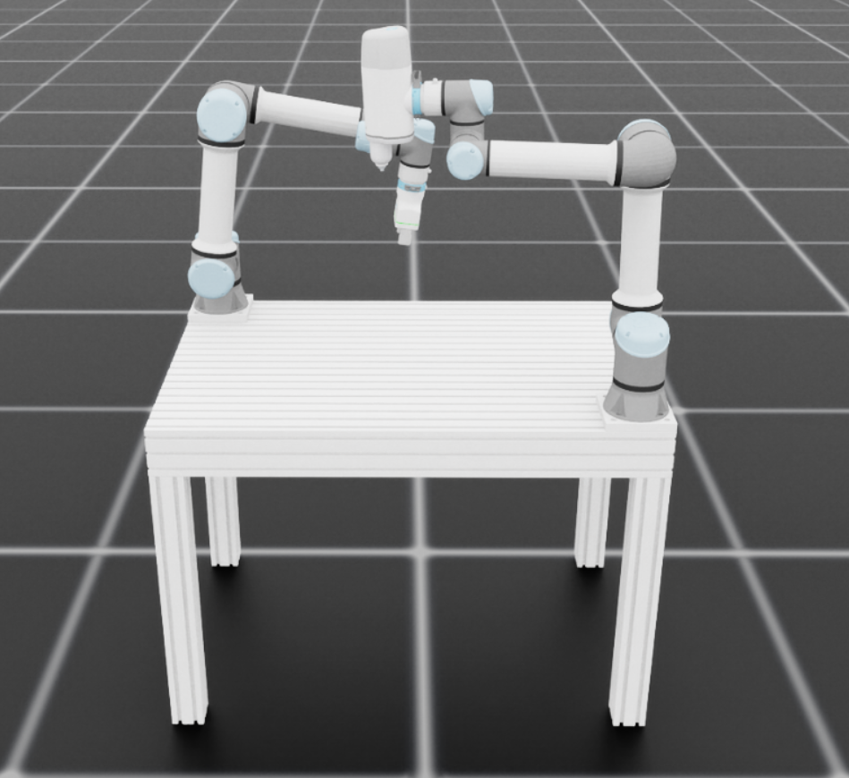

# Template for Isaac Lab Project Woodworking

## Overview

This is an external Isaac Lab project for the IDEALB Woodworking setup at ETHZ.

## Installation
- Installation has been tested with Isaac Sim 5.0.0 and Isaac Lab 2.2.1

- Install Isaac Lab by following the [installation guide](https://isaac-sim.github.io/IsaacLab/main/source/setup/installation/index.html).
  We recommend using the conda installation as it simplifies calling Python scripts from the terminal.

- Clone or copy this project/repository separately from the Isaac Lab installation (i.e. outside the `IsaacLab` directory):

- Using a python interpreter that has Isaac Lab installed, install the library in editable mode using:

    ```bash
    # use 'PATH_TO_isaaclab.sh|bat -p' instead of 'python' if Isaac Lab is not installed in Python venv or conda
    python -m pip install -e source/Woodworking_Simulation

- Verify that the extension is correctly installed by:

    - Listing the available tasks:

        Note: It the task name changes, it may be necessary to update the search pattern `"Template-"`
        (in the `scripts/list_envs.py` file) so that it can be listed.

        ```bash
        # use 'FULL_PATH_TO_isaaclab.sh|bat -p' instead of 'python' if Isaac Lab is not installed in Python venv or conda
        python scripts/list_envs.py
        ```

    - Running a task:

        ```bash
        # use 'FULL_PATH_TO_isaaclab.sh|bat -p' instead of 'python' if Isaac Lab is not installed in Python venv or conda
        python scripts/<RL_LIBRARY>/train.py --task=<TASK_NAME>
        ```

    - Running a task with dummy agents:

        These include dummy agents that output zero or random agents. They are useful to ensure that the environments are configured correctly.

        - Zero-action agent

            ```bash
            # use 'FULL_PATH_TO_isaaclab.sh|bat -p' instead of 'python' if Isaac Lab is not installed in Python venv or conda
            python scripts/zero_agent.py --task=<TASK_NAME>
            ```
        - Random-action agent

            ```bash
            # use 'FULL_PATH_TO_isaaclab.sh|bat -p' instead of 'python' if Isaac Lab is not installed in Python venv or conda
            python scripts/random_agent.py --task=<TASK_NAME>
            ```

### Set up IDE

To setup the IDE, please follow these instructions:

- Run VSCode Tasks, by pressing `Ctrl+Shift+P`, selecting `Tasks: Run Task` and running the `setup_python_env` in the drop down menu.
  When running this task, you will be prompted to add the absolute path to your Isaac Sim installation.

If everything executes correctly, it should create a file .python.env in the `.vscode` directory.
The file contains the python paths to all the extensions provided by Isaac Sim and Omniverse.
This helps in indexing all the python modules for intelligent suggestions while writing code.

## Import the Assets

### Import Table

- Assambly_Table.usd has been created in SolidWorks has been added to onshape and then imported via the onshape import button in Isaac Sim

### Import ONrobot 2fg7 Gripper

- Clone repository

    ```bash
    git clone https://github.com/juandpenan/onrobot_2FG7_gripper_description
    ```
- Creat main xacro file in urdf folder name it onrobot_2fg7_main.xacro and copy the follwoing into the empty file:

    ```bash
    <?xml version="1.0"?>
    <robot xmlns:xacro="http://www.ros.org/wiki/xacro" name="onrobot_2fg7">
        <!-- Add required properties -->
        <xacro:property name="control_bool" value="true"/>
        <xacro:property name="config" value="outwards"/>
        
        <!-- Include the gripper macro -->
        <xacro:include filename="onrobot_2fg7.xacro"/>
        
        <!-- Instantiate the gripper with correct parameter -->
        <xacro:onrobot_2fg7_gripper prefix="" finger_configuration="${config}"/>
    </robot>
    ```

- Replace the top part of onrobot_2fg7.xacro

    ```bash
    <?xml version="1.0" ?>
    <robot name="2fg7_outwards" xmlns:xacro="http://www.ros.org/wiki/xacro">

    <xacro:include filename="$(find onrobot_2fg7_description)/urdf/materials.xacro" />
    <xacro:include filename="$(find onrobot_2fg7_description)/urdf/onrobot_2fg7.trans.xacro" />
    <xacro:include filename="$(find onrobot_2fg7_description)/urdf/onrobot_2fg7.gazebo" />
    <xacro:gripper_transmission/>
    <xacro:gazebo_control is_control_on="false" />
                                                    

    <xacro:macro name="onrobot_2fg7_gripper" params="prefix finger_configuration=outwards">
    ```
    and replace all 2fg7 with 2FG7 as xacro is case sensitive

- Install xacro (do so in your isaac_lan env)

    ```bash
    pip install git+https://github.com/ros/xacro.git@ros2
    ```

- Convert xacro to urdf

    ```bash
    xacro onrobot_2fg7_main.xacro -o onrobot_2fg7_expanded.urdf
    ```
- Then start up isaac-sim and click file import and import the .urdf file this will creat a new subfolder in the urdf folder. The content of this subfolder has to be copied into the asset folder in isaac_lab

### Import OnRobot Screwdriver

- Clone repository

    We downloaded the screwdriver from this repo and had to change it up to get it working in Isaac Sim

    ```bash
    git clone https://github.com/Daniella1/robot_urdfs
    ```

    I rewrote the .urdf file

    ```bash
    <?xml version="1.0" ?>
    <robot name="onrobot_screwdriver_working">
    <!-- <material name="silver">
        <color rgba="0.700 0.700 0.700 1.000"/>
    </material> -->
    <gazebo reference="link0">
        <material>Gazebo/Grey</material>
        <implicitSpringDamper>1</implicitSpringDamper>
        <mu1>0.2</mu1>
        <mu2>0.2</mu2>
        <kp>100000000.0</kp>
        <kd>1.0</kd>
        <selfCollide>true</selfCollide>
        <gravity>true</gravity>
    </gazebo>
    <link name="link0">
        <inertial>
        <origin rpy="0 0 0" xyz="0 0 0"/>
        <mass value="4.0"/>
        <inertia ixx="0.00443333156" ixy="0.0" ixz="0.0" iyy="0.00443333156" iyz="0.0" izz="0.0072"/>
        </inertial>
        <visual>
        <origin xyz="0.0 0.0 0.0" rpy="0.0 0.0 0.0"/>
        <geometry>
            <mesh filename="C:/Users/pasca/SynologyDrive/04_ETH/91_Bachlor_Thesis/60_Onrobot_screwdriver/screwdriver/visual/body.dae"/>
        </geometry>
        <!-- <material name="silver"/> -->
        </visual>
        <collision>
        <origin xyz="0.0 0.0 0.0" rpy="0.0 0.0 0.0"/>
        <geometry>
            <mesh filename="C:/Users/pasca/SynologyDrive/04_ETH/91_Bachlor_Thesis/60_Onrobot_screwdriver/screwdriver/collision/body.stl"/>
        </geometry>
        </collision>
    </link>
    <joint name="joint0" type="prismatic">
        <parent link="link0"/>
        <child link="link1"/>
        <origin rpy="0.0 0.0 0.0" xyz="0.0 -0.0 0.0"/>
        <axis xyz="0 0 -1"/>
        <limit effort="150.0" lower="0.0" upper="0.055" velocity="1.5"/>
    </joint>
    <link name="link1">
        <visual>
        <!-- <origin xyz="0.0 -0.0915 -0.13" rpy="0.0 0.0 0.0"/> -->
        <origin xyz="0.0 -0.09685 -0.13" rpy="0.0 0.0 0.0"/>
        <geometry>
            <mesh filename="C:/Users/pasca/SynologyDrive/04_ETH/91_Bachlor_Thesis/60_Onrobot_screwdriver/screwdriver/visual/shank_bit.dae"/>
        </geometry>
        <material name="silver"/>
        </visual>
        <collision>
        <origin xyz="0.0 -0.0915 -0.13" rpy="0.0 0.0 0.0"/>
        <geometry>
            <mesh filename="C:/Users/pasca/SynologyDrive/04_ETH/91_Bachlor_Thesis/60_Onrobot_screwdriver/screwdriver/collision/shank_bit.stl"/>
        </geometry>
        </collision>
    </link>
    </robot>
    ```

    I imported the .stl files provided from OnRobot into Onshape were I created a assambly with the quickconnecter.
    Then I hade to export it to .step reimport into Onshape with create one file to finaly export to .dae .


## Building Blocks

The robot builds an assembly from given parts (building blocks) in USD format.


Store the parts in USD format in this folder:

```bash
 "USD_files"
```

### STL to USD
If no USD format is available the built in STL to USD converter can be used.\
Store the parts in STL format in this folder:

```bash
"STL_files"
```

This script creates USD files for you:

```bash
"scripts/STL to usd/run_converter.py"
```

The converted files are stored in this folder:
```bash
"USD_files"
```

The material assumed is dry spruce with density $\rho  = 470 \frac{kg}{m³}$ .

### by Dimensions

This option works only for rectangular cuboidic geometries (blocks, plates, bars etc.).

The dimensions can be set in this file:
```bash
"config/plates.yaml"

plates:
  - name: "Holzplatte_1"
    width: 500 
    depth: 300
    thickness: 10
    position: [0, 0, 0]
```

